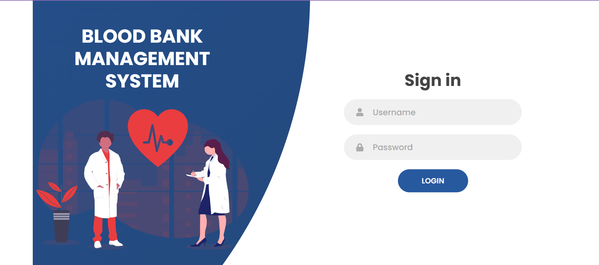
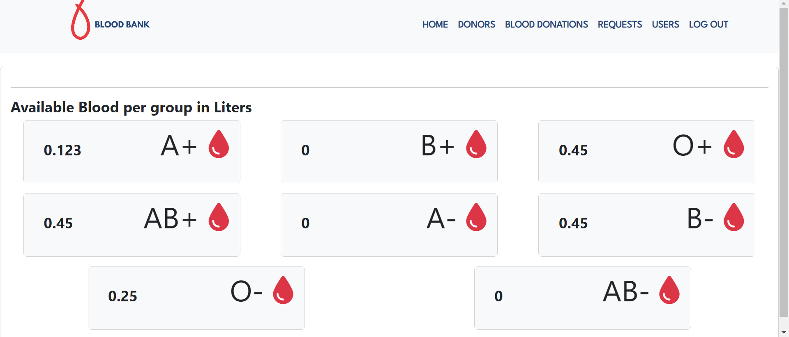
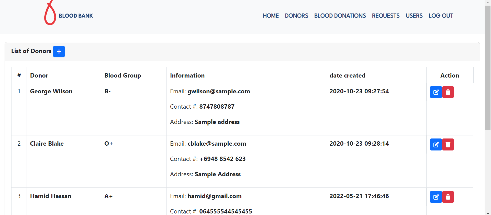
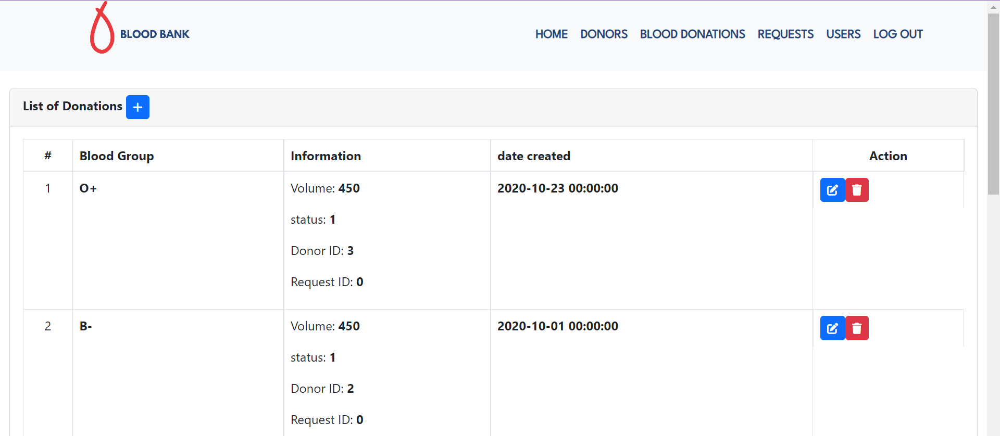
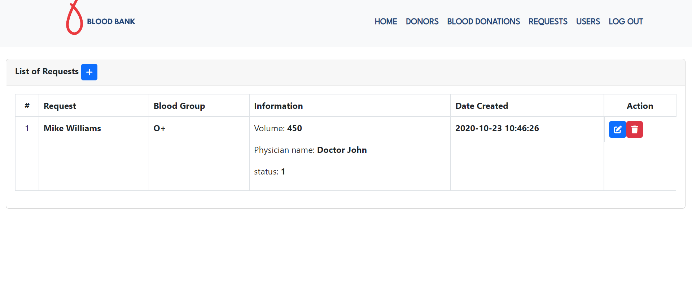
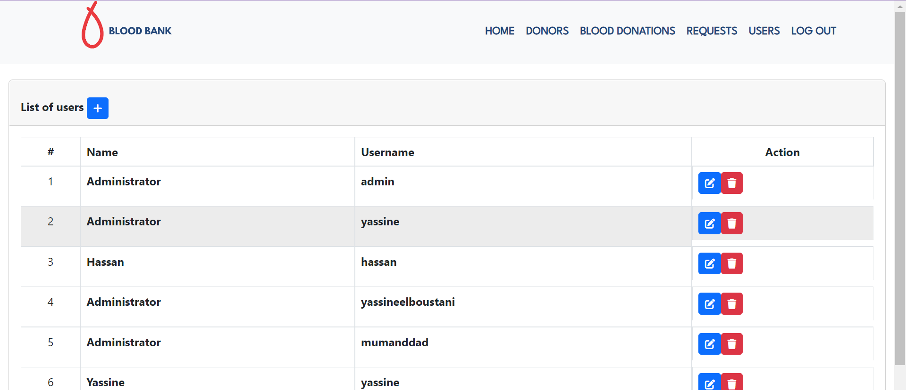

<h1>blood-bank-management-php-mvc</h1>
<h2>Login</h2>

<h2>Home</h2>

<h2>Donors</h2>

<h2>Donations</h2>

<h2>Requests</h2>

<h2>Users</h2>

 
<h2>Admin</h2>
 

After admin Login, can see Unit of blood of each blood group available,  Donors , blood requests,donations,users.
  <ul>
    <li>Can create , Update, Delete Donor.</li>
    <li>Can create , Update, Delete Donations.</li>
    <li>Can create , Update, Delete users.</li>
    <li>Can create , Update, Delete requests.</li>
    <li>Can see Unit of blood of each blood group available.</li>
    </ul>
 

 

  <h3>you can login by using</h3>
  <ul>
    <li>Username: admin </li>
    <li>Password: admin </li>
   </ul>

